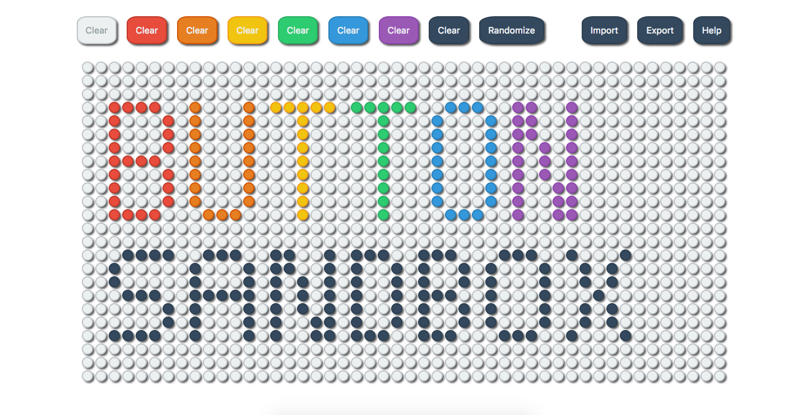
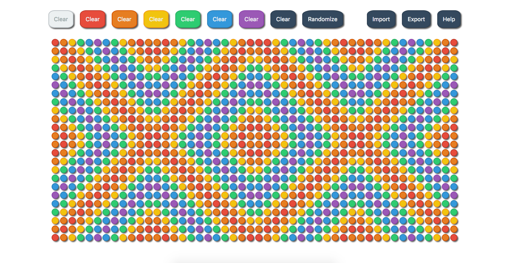
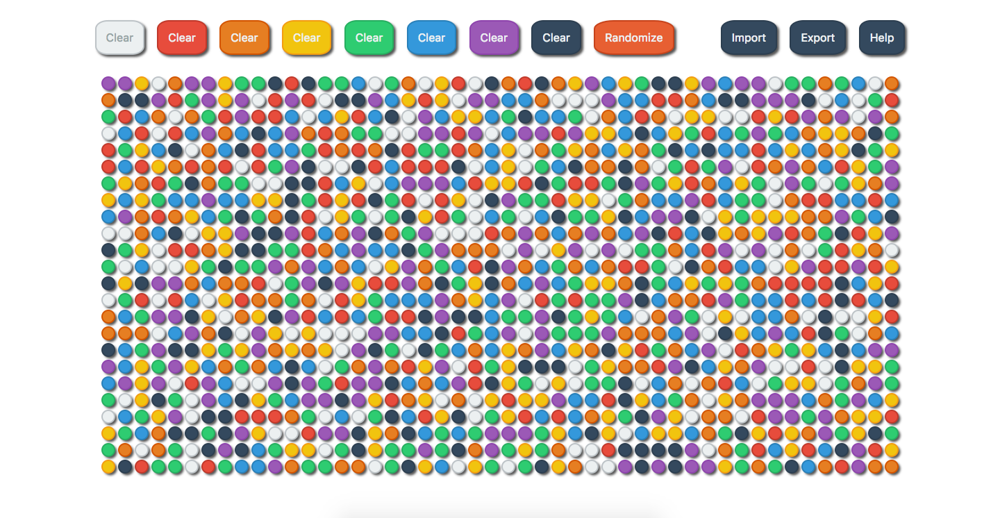

## Welcome to Button Sandbox.

This is a sandbox game that uses simple HTML mechanics in unique ways to encourage creativity and, with the help of the user, create art.

The mechanics are simple - to change the color of a buttom, click it. It will cycle between the colors of the rainbow, and white and black are included for good measure. Additionally, each "Clear" button at the top of the page will make every button the corresponding color, and the Randomize button does what you'd expect - it randomizes the color of each button.

That's basically it! This project was made with the intention of creating a website that aids in stress relief and anxiety reduction. I hope, more than anything, that it will help people. It's already helped me.

Feel free to [Email me](mailto:ProfessorLWebDev@gmail.com) with suggestions, questions, or complaints, and be sure to check out my other projects, [Colors](https://professor-l.github.io/colors/), [The Colors Game](https://professor-l.github.io/the-colors-game/), and [Counting](https://professor-l.github.io/counting/). Thanks!

~ Professor L, Web Developer
